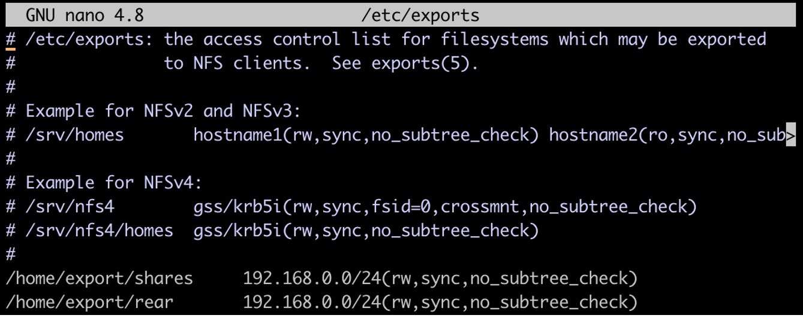

<b>Using Relax-and-Recover (ReaR)</b>
ReaR is a powerful disaster recovery and system migration tool written in Bash. It can also be  installed on Ubuntu using. The following command:  
`sudo apt install rear` 
Once the packages have been installed, check out the main configuration file  called /etc/rear/local.conf that contains all the configuration options. By default, ReaR  makes ISO files, but it also supports Samba (CIFS), USB, and NFS as destinations.  
<b>Backing up to a local NFS server using ReaR<b>
Let’s take a look at the example of backing up to an NFS server. Let’s say, we already have an <b>NFS server set up on one of our Ubuntu machines on our network.<b>
First, we must configure the NFS server. The configuration file for NFS /etc/exports stores <b>information about the share's location. Before we add any new information about the ReaR <b>backup share's location, we will create a new directory for our RearR backups as follows:<b>
`sudo mkdir /home/export/rear `
Now, we need to change ownership because we will not have permission to write the backup to  this location of the owner is root: 
`sudo chown -R nobody:nogroup /home/export/rear/` 
Now, open the /etc/exports file and add a new line for the backup directory as follows: 

